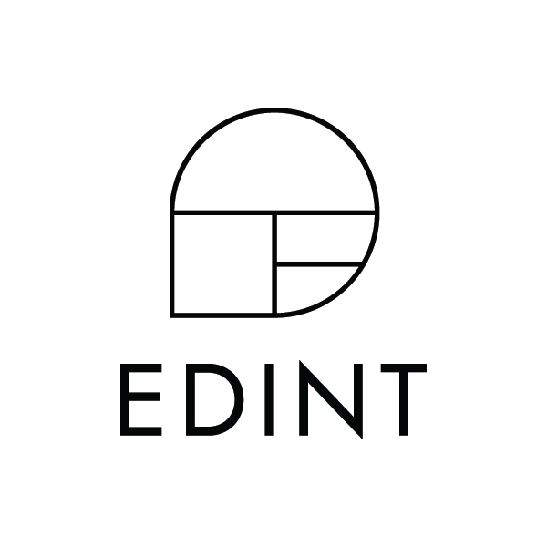

# Proctormatic AI Analysis

<p align="center">
  
</p>

---

## 📝 개요

**OpenSource** 프로젝트는 EDINT의 OpenSource AI 기술력을 가지고 개발한 오픈소스 솔루션입니다.  
YOLO, MediaPipe AI 기술을 활용하여, 다양한 기술로 구성되어 있습니다.

---

## ⚙️ 주요 기능

- **AI Model Predict Valid**
  - YOLO Object-Detection 모델을 On-Device 환경에 맞게 축소하고 Predict 작동 결과를 검증합니다.
- **AI Predict Time Valid**
  - YOLO Object-Detection 모델을 원본 모델과 On-Device 환경에 맞춰 최적화한 모델을 통해 동일 영상을 추론하여 시간을 측정 & 비교합니다.
- **Eye-Tracking**
  - MediaPipe FaceMesh 모델을 가지고 홍채 인식을 통한 시선을 추적합니다.

---
## 설치 방법
## Installation

To set up and run the NIPA AI-based Automatic Code Generation Service, follow these steps:

1.  **Create a virtual environment (recommended):**

    ```bash
    python -m venv venv
    source venv/bin/activate  # On Windows: `venv\Scripts\activate`
    ```

3.  **Install the required dependencies:**

    The project dependencies are listed in `requirements.txt`.

    ```bash
    pip install -r requirements.txt
    ```

## 🚀 실행 방법 (GUI)

**1. Eye-Tracking GUI 모드 실행.**   

```bash
python main_eye_tracking_valid.py
```

**2. Model Size Valid GUI 모드 실행.**   

```bash
python main_size_valid.py
```

**3. Model Predict Speed Valid GUI 모드 실행.**   

```bash
python main_time_valid.py
```


## 🪪 License

- This project uses components under the AGPL 3.0 (Affero General Public License 3.0).
- AGPL 3.0 is a strong copyleft license and includes the following key requirements:

**✔ Key Points**

소스코드 공개 의무:
본 소프트웨어를 수정하거나 재배포하는 경우, 변경된 전체 소스코드를 반드시 공개해야 합니다.

네트워크 서비스 제공 시에도 공개 필요:
웹 서비스(SaaS, API 등) 형태로 제공하는 경우에도 소스코드 공개 의무가 적용됩니다.

동일 라이선스 적용:
재배포 시 반드시 AGPL 3.0을 유지해야 합니다.

상업적 이용 가능:
단, 위의 공개 의무가 그대로 적용됩니다.

**✔ 참고**

Mediapipe → Apache License 2.0 (자유로운 상업적 사용 가능, 소스 공개 의무 없음)

YOLO 계열 → 모델마다 AGPL 3.0 / GPL 3.0 / MIT 등이 다름
사용한 모델의 개별 라이선스를 반드시 확인하세요.
    